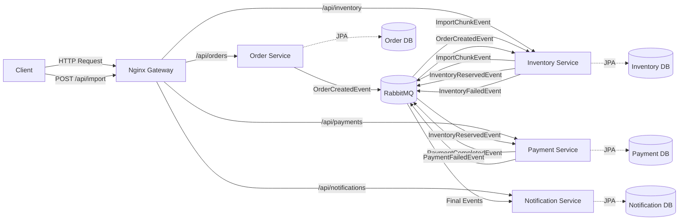

# Event-Driven Order Fulfillment System

A fully event-driven microservices architecture demonstrating asynchronous communication using **Java 17**, **Spring Boot**, **RabbitMQ**, **PostgreSQL**, and **Docker**. This system implements a complete order fulfillment workflow with zero REST-based inter-service communication.

## 🏗️ System Architecture



## 📋 Table of Contents

- [Features](#features)
- [Technology Stack](#technology-stack)
- [Microservices Overview](#microservices-overview)
- [Event Flow](#event-flow)
- [RabbitMQ Topology](#rabbitmq-topology)
- [Prerequisites](#prerequisites)
- [Quick Start](#quick-start)
- [API Usage](#api-usage)
- [Testing Scenarios](#testing-scenarios)
- [Monitoring](#monitoring)
- [Project Structure](#project-structure)
- [Database Schema](#database-schema)

## ✨ Features

- **Event-Driven Architecture**: Pure asynchronous communication via RabbitMQ
- **Microservices Pattern**: Four independent, loosely coupled services
- **Database Per Service**: Complete data isolation with PostgreSQL
- **Container Orchestration**: Fully Dockerized with Docker Compose
- **Message-Driven Workflows**: Topic exchanges with routing keys
- **Saga Pattern**: Distributed transaction handling with compensating actions
- **JSON Events**: Structured event payloads with metadata
- **High-Volume CSV Data Upload**: Asynchronous processing of large CSV files (2M+ records) using RabbitMQ for chunking and flow control
- **API Gateway**: Nginx configured as a reverse proxy for load balancing and routing
- **Production-Ready**: Health checks, logging, and error handling

## 🛠️ Technology Stack

| Component | Technology | Version |
|-----------|-----------|---------|
| Language | Java | 17 |
| Framework | Spring Boot | 3.2.1 |
| Database | PostgreSQL | 16 |
| Message Broker | RabbitMQ | 3.12 |
| ORM | Hibernate/JPA | - |
| Build Tool | Maven | 3.9.5 |
| Container | Docker | - |
| Orchestration | Docker Compose | 3.8 |
| Gateway | Nginx | 1.25 |

## 🎯 Microservices Overview

### 1. Order Service (Port 8081)
- **Responsibility**: REST API for order creation
- **Database**: `order_db`
- **Publishes**: `OrderCreatedEvent`
- **REST Endpoints**:
  - `POST /api/orders` - Create new order
  - `GET /api/orders` - List all orders
  - `GET /api/orders/{id}` - Get order by ID

### 2. Inventory Service (Port 8082)
- **Responsibility**: Inventory availability checking and reservation
- **Database**: `inventory_db`
- **Consumes**: `OrderCreatedEvent`
- **Publishes**: `InventoryReservedEvent`, `InventoryFailedEvent`
- **Features**:
  - Pre-initialized with sample inventory (PROD-001, PROD-002, PROD-003)
  - Stock reservation mechanism
  - Availability validation

### 3. Payment Service (Port 8083)
- **Responsibility**: Payment processing simulation
- **Database**: `payment_db`
- **Consumes**: `InventoryReservedEvent`
- **Publishes**: `PaymentCompletedEvent`, `PaymentFailedEvent`
- **Features**:
  - 80% success rate for demo purposes
  - Transaction tracking
  - Payment status persistence

### 4. Notification Service (Port 8084)
- **Responsibility**: Customer notifications
- **Database**: `notification_db`
- **Consumes**: `InventoryFailedEvent`, `PaymentCompletedEvent`, `PaymentFailedEvent`
- **Features**:
  - Email simulation (logged)
  - SMS simulation (logged)
  - Notification history persistence

## 🔄 Event Flow

### Success Scenario

```
1. Client → POST /api/orders → Order Service
2. Order Service → OrderCreatedEvent → RabbitMQ
3. Inventory Service ← OrderCreatedEvent ← RabbitMQ
4. Inventory Service → InventoryReservedEvent → RabbitMQ
5. Payment Service ← InventoryReservedEvent ← RabbitMQ
6. Payment Service → PaymentCompletedEvent → RabbitMQ
7. Notification Service ← PaymentCompletedEvent ← RabbitMQ
8. Notification Service → Sends Email + SMS
```

### Failure Scenarios

#### Inventory Failure
```
1-3. (Same as success)
4. Inventory Service → InventoryFailedEvent → RabbitMQ
5. Notification Service ← InventoryFailedEvent ← RabbitMQ
6. Notification Service → Sends failure notification
```

#### Payment Failure
```
1-5. (Same as success)
6. Payment Service → PaymentFailedEvent → RabbitMQ
7. Notification Service ← PaymentFailedEvent ← RabbitMQ
8. Notification Service → Sends failure notification
```

## 🐰 RabbitMQ Topology

### Exchanges

| Exchange | Type | Description |
|----------|------|-------------|
| `order.events` | Topic | Order-related events |
| `inventory.events` | Topic | Inventory-related events |
| `payment.events` | Topic | Payment-related events |

### Queues and Bindings

| Queue | Exchange | Routing Key | Consumer |
|-------|----------|-------------|----------|
| `order-created-queue` | `order.events` | `order.created` | Inventory Service |
| `inventory-reserved-queue` | `inventory.events` | `inventory.reserved` | Payment Service |
| `inventory-failed-queue` | `inventory.events` | `inventory.failed` | Notification Service |
| `payment-completed-queue` | `payment.events` | `payment.completed` | Notification Service |
| `payment-failed-queue` | `payment.events` | `payment.failed` | Notification Service |

### Event Schema

All events extend `BaseEvent` with:
```json
{
  "eventId": "uuid",
  "eventType": "EVENT_TYPE",
  "timestamp": "2026-01-15T22:43:06",
  "sourceService": "service-name",
  // event-specific fields
}
```

## 📦 Prerequisites

- **Docker Desktop**: Version 20.10 or higher
- **Docker Compose**: Version 2.0 or higher
- **Memory**: At least 4GB available for containers
- **Port Availability**: 5432-5435, 5672, 8081-8084, 15672

## 🚀 Quick Start

### 1. Clone and Navigate
```bash
cd /Users/zahid/Projects/AI/shoping
```

### 2. Build and Start All Services
```bash
docker-compose up --build
```

This will:
- Build Docker images for all 4 microservices
- Start RabbitMQ with management plugin
- Start 4 PostgreSQL databases
- Start all microservices with proper dependencies

### 3. Wait for Services to be Ready

Monitor logs until you see:
```
order-service       | Started OrderServiceApplication
inventory-service   | Started InventoryServiceApplication
payment-service     | Started PaymentServiceApplication
notification-service| Started NotificationServiceApplication
```

### 4. Verify System Health

**Check Container Status:**
```bash
docker-compose ps
```

All services should show status as `Up`.

**Access RabbitMQ Management UI:**
- URL: http://localhost:15672
- Username: `guest`
- Password: `guest`

## 📖 API Usage

### Create an Order

**Successful Order (Product in Stock):**
```bash
curl -X POST http://localhost:8081/api/orders \
  -H "Content-Type: application/json" \
  -d '{
    "customerId": "CUST-001",
    "items": [
      {
        "productId": "PROD-001",
        "productName": "Laptop",
        "quantity": 2,
        "price": 999.99
      }
    ]
  }'
```

**Response:**
```json
{
  "orderId": 1,
  "customerId": "CUST-001",
  "totalAmount": 1999.98,
  "status": "PENDING",
  "createdAt": "2026-01-15T22:43:06",
  "items": [
    {
      "id": 1,
      "productId": "PROD-001",
      "productName": "Laptop",
      "quantity": 2,
      "price": 999.99
    }
  ]
}
```

### Get All Orders
```bash
curl http://localhost:8081/api/orders
```

### Get Order by ID
```bash
### Get Order by ID
```bash
curl http://localhost:8081/api/orders/1
```

### Import Products (CSV)
Triggers an asynchronous import job for a CSV file located on the server (mounted volume).

```bash
# Default file: products-2000000.csv
curl -X POST http://localhost/api/import

# Custom file name
curl -X POST "http://localhost/api/import?fileName=test-products.csv"
```

**Response:**
```json
"Import started for file: /Users/zahid/Projects/AI/shoping/products-2000000.csv. Job ID: 550e8400-e29b-41d4-a716-446655440000"
```

### Check Import Status
```bash
curl http://localhost/api/import/{jobId}
```

## 🎯 Swagger/OpenAPI Documentation

The Order Service includes interactive API documentation using Swagger UI.

**Access Swagger UI**:
- URL: http://localhost:8081/swagger-ui.html
- OpenAPI JSON: http://localhost:8081/api-docs

**Features**:
- Interactive API testing interface
- Complete request/response schemas
- Example values and parameter descriptions
- Try-it-out functionality for all endpoints

**Available Endpoints in Swagger**:
- `POST /api/orders` - Create a new order
- `GET /api/orders` - Get all orders
- `GET /api/orders/{orderId}` - Get order by ID

You can test the APIs directly from the Swagger UI without needing curl or Postman!

## 🧪 Testing Scenarios

### Scenario 1: Successful Order Flow
```bash
curl -X POST http://localhost:8081/api/orders \
  -H "Content-Type: application/json" \
  -d '{
    "customerId": "CUST-001",
    "items": [
      {
        "productId": "PROD-002",
        "productName": "Mouse",
        "quantity": 1,
        "price": 29.99
      }
    ]
  }'
```

**Expected Flow:**
1. ✅ Order created in Order Service
2. ✅ Inventory reserved (50 available)
3. ✅ Payment processed (80% chance)
4. ✅ Email + SMS notifications sent

**Check Logs:**
```bash
docker-compose logs -f notification-service
```

You should see:
```
📧 EMAIL NOTIFICATION SENT:
Subject: Order #1 - Payment Successful!
📱 SMS NOTIFICATION SENT:
```

### Scenario 2: Insufficient Inventory
```bash
curl -X POST http://localhost:8081/api/orders \
  -H "Content-Type: application/json" \
  -d '{
    "customerId": "CUST-002",
    "items": [
      {
        "productId": "PROD-001",
        "productName": "Laptop",
        "quantity": 100,
        "price": 999.99
      }
    ]
  }'
```

**Expected Flow:**
1. ✅ Order created
2. ❌ Inventory check fails (only 10 available)
3. ✅ Inventory failed notification sent

### Scenario 3: Payment Failure
Create multiple orders - approximately 20% will fail payment processing due to the simulated failure rate.

```bash
for i in {1..5}; do
  curl -X POST http://localhost:8081/api/orders \
    -H "Content-Type: application/json" \
    -d '{
      "customerId": "CUST-003",
      "items": [
        {
          "productId": "PROD-003",
          "productName": "Keyboard",
          "quantity": 1,
          "price": 49.99
        }
      ]
    }'
  sleep 1
done
```

**Expected**: ~1 order will fail payment and trigger failure notification.

## 📊 Monitoring

### RabbitMQ Management UI

**Access**: http://localhost:15672

**Features**:
- View exchanges and bindings
- Monitor queue depths
- Track message rates
- View message flow

**Navigate to**:
- **Exchanges**: See `order.events`, `inventory.events`, `payment.events`
- **Queues**: See all 5 queues with message counts
- **Connections**: See active connections from services

### Database Inspection

**Connect to Order Database:**
```bash
docker exec -it order-db psql -U orderuser -d order_db

# View tables
\dt

# View orders
SELECT * FROM orders;
SELECT * FROM order_items;
```

**Connect to Inventory Database:**
```bash
docker exec -it inventory-db psql -U inventoryuser -d inventory_db

# View inventory
SELECT * FROM inventory_items;
```

**Connect to Payment Database:**
```bash
docker exec -it payment-db psql -U paymentuser -d payment_db

# View payments
SELECT * FROM payments;
SELECT * FROM payment_transactions;
```

**Connect to Notification Database:**
```bash
docker exec -it notification-db psql -U notificationuser -d notification_db

# View notifications
SELECT * FROM notification_logs ORDER BY sent_at DESC;
```

### Service Logs

**View All Logs:**
```bash
docker-compose logs -f
```

**View Specific Service:**
```bash
docker-compose logs -f order-service
docker-compose logs -f inventory-service
docker-compose logs -f payment-service
docker-compose logs -f notification-service
```

**View RabbitMQ Logs:**
```bash
docker-compose logs -f rabbitmq
```

## 📁 Project Structure

```
event-driven-order-fulfillment/
├── order-service/
│   ├── src/main/java/com/example/order/
│   │   ├── config/          # RabbitMQ configuration
│   │   ├── controller/      # REST API endpoints
│   │   ├── dto/             # Request/Response DTOs
│   │   ├── entity/          # JPA entities
│   │   ├── messaging/       # Event producers & DTOs
│   │   ├── repository/      # JPA repositories
│   │   └── service/         # Business logic
│   ├── src/main/resources/
│   │   └── application.yml
│   ├── Dockerfile
│   └── pom.xml
│
├── inventory-service/       # Similar structure
├── payment-service/         # Similar structure
├── notification-service/    # Similar structure
│
├── docker-compose.yml
└── README.md
```

## 💾 Database Schema

### Order Service Schema

**orders**
- id (PK)
- customer_id
- total_amount
- status (PENDING, CONFIRMED, PROCESSING, COMPLETED, FAILED)
- created_at

**order_items**
- id (PK)
- order_id (FK)
- product_id
- product_name
- quantity
- price

### Inventory Service Schema

**inventory_items**
- id (PK)
- product_id (UNIQUE)
- product_name
- available_quantity
- reserved_quantity
- updated_at

### Payment Service Schema

**payments**
- id (PK)
- order_id
- customer_id
- amount
- status (PENDING, PROCESSING, COMPLETED, FAILED)
- payment_method
- created_at
- completed_at
- failure_reason

**payment_transactions**
- id (PK)
- payment_id (FK)
- transaction_id
- amount
- gateway
- status (INITIATED, SUCCESS, FAILED)
- timestamp
- response_code
- response_message

### Notification Service Schema

**notification_logs**
- id (PK)
- event_type
- order_id
- customer_id
- message
- recipient_info
- channel (EMAIL, SMS, PUSH)
- status (PENDING, SENT, FAILED)
- sent_at

## 🔧 Configuration

### Environment Variables

Each service can be configured via environment variables in `docker-compose.yml`:

**Database Configuration:**
- `DB_HOST`: Database hostname
- `DB_NAME`: Database name
- `DB_USER`: Database username
- `DB_PASSWORD`: Database password

**RabbitMQ Configuration:**
- `RABBITMQ_HOST`: RabbitMQ hostname
- `RABBITMQ_PORT`: RabbitMQ port (5672)
- `RABBITMQ_USER`: RabbitMQ username
- `RABBITMQ_PASSWORD`: RabbitMQ password

## 🛑 Stopping the System

**Stop All Services:**
```bash
docker-compose down
```

**Stop and Remove Volumes (Complete Cleanup):**
```bash
docker-compose down -v
```

**Remove Built Images:**
```bash
docker-compose down --rmi all
```

## 🐛 Troubleshooting

### Services Won't Start

**Issue**: Service fails to connect to RabbitMQ
```bash
# Check RabbitMQ status
docker-compose logs rabbitmq

# Restart RabbitMQ
docker-compose restart rabbitmq
```

**Issue**: Service fails to connect to database
```bash
# Check database logs
docker-compose logs order-db

# Verify database is healthy
docker exec -it order-db pg_isready -U orderuser -d order_db
```

### RabbitMQ Queue Issues

**Issue**: Messages not being consumed
```bash
# Check if queues are bound correctly
# Visit: http://localhost:15672/#/queues
# Verify bindings in "Bindings" section
```

### Nginx 502 Bad Gateway

**Issue**: Nginx returns 502 Bad Gateway because it holds onto stale IP addresses after backend services restart.
**Solution**: Configure Nginx to use Docker's embedded DNS resolver (`127.0.0.11`) and variables for upstreams to force dynamic resolution.

```nginx
resolver 127.0.0.11 valid=10s;
set $backend_host service-name;
proxy_pass http://$backend_host:port;
```

### Port Conflicts

**Issue**: Port already in use
```bash
# Check what's using the port
lsof -i :8081

# Modify port mapping in docker-compose.yml if needed
```

## 📚 Additional Resources

- [Spring Boot Documentation](https://spring.io/projects/spring-boot)
- [RabbitMQ Tutorials](https://www.rabbitmq.com/getstarted.html)
- [Spring AMQP Reference](https://docs.spring.io/spring-amqp/reference/)
- [Docker Compose Documentation](https://docs.docker.com/compose/)

## 🎓 Learning Outcomes

This project demonstrates:

1. **Event-Driven Architecture**: Asynchronous, loosely coupled microservices
2. **Message-Driven Communication**: RabbitMQ topic exchanges and routing
3. **Database Per Service**: Complete data isolation
4. **Event Sourcing Patterns**: Event metadata and structured payloads
5. **Saga Pattern**: Distributed transactions with compensating actions
6. **Container Orchestration**: Multi-container application deployment
7. **Service Dependencies**: Proper startup ordering and health checks
8. **Error Handling**: Graceful failure handling and notifications

## 🔐 Production Considerations

For production deployment, consider:

1. **Security**:
   - Use secure credentials (not defaults)
   - Implement authentication/authorization
   - Enable TLS for RabbitMQ and databases

2. **Scalability**:
   - Add load balancers
   - Enable horizontal scaling for services
   - Use RabbitMQ clustering

3. **Resilience**:
   - Implement circuit breakers
   - Add retry mechanisms with exponential backoff
   - Use dead-letter queues

4. **Monitoring**:
   - Add Prometheus + Grafana
   - Implement distributed tracing (Zipkin/Jaeger)
   - Set up centralized logging (ELK stack)

5. **High Availability**:
   - Deploy PostgreSQL with replication
   - Use RabbitMQ quorum queues
   - Implement service mesh (Istio)

---

**Built with ❤️ using Event-Driven Architecture**
